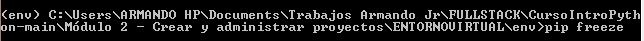
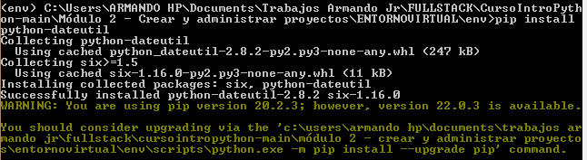
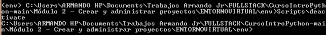
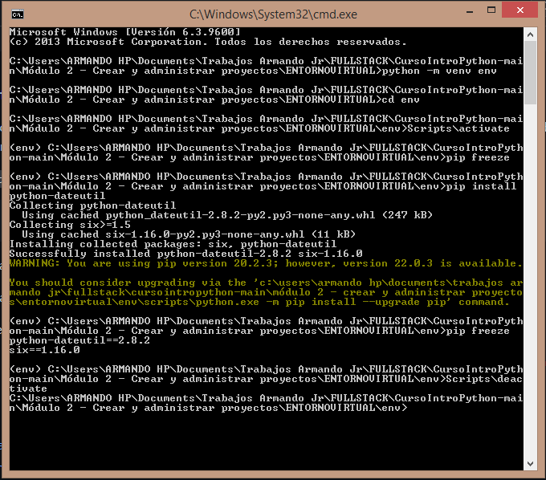

# Ejercicio - Crear un paquete

En este ejercicio, aprenderás a utilizar entornos virtuales como una forma para no afectar a los paquetes instalados globalmente u otros programas que se ejecutan en tu máquina.

*Para este ejercicio es necesario que lo ejecutes desde la terminal, línea de comandos, cmd, consola, cli, etc. de tu computadora, sé que es desafíante, pero no te preocupes ¡¡Sé que puedes lograrlo!!*

## Crear un entorno virtual

Crea un entorno virtual mediante ``venv``

* Ejecutar en su terminal: ``python3 -m venv env`` o bien ``python -m venv env``

  ```
     python3 -m venv env 
  ```

  ``python -m venv env``
  Ahora tienes un directorio (folder) ``env`` creado en tu terminal.

  
* Ejecuta el comando para activar el entorno virtual: ``source env/bin/activate``

  ```
  source env/bin/activate
  # Windows
  env\bin\activate

  o bien: 
  env\Scripts\activate

  # Linux, WSL or macOS
  source env/bin/activate
  ```

Ahora ves en tu terminal ``(env)``. Eso significa que has activado tu entorno virtual y se ha aislado del resto de tu máquina.


Instalar una biblioteca

Ahora que estás dentro de tu entorno virtual, puedes instalar una biblioteca y saber que la biblioteca solo existirá en el entorno virtual.

* Ejecuta el comando ``pip freeze`` para ver las bibliotecas instaladas en tu entorno:

  ```
  pip freeze
  ```

  No deberías obtener respuesta. A continuación, veamos cómo cambia la salida de ``pip freeze`` cuando se agrega una biblioteca (un paquete).

  
* Ejecuta el comando ``pip install`` para instalar una biblioteca:

  ```
  pip install python-dateutil
  ```

  
* Un gran mensaje de salida de texto dice que está instalando tu biblioteca, y debe terminar con la siguiente oración:

```
  Successfully installed python-dateutil-2.8.2 six-1.16.0
```

* Vuelve a ejecutar ``pip freeze`` para ver cómo ha cambiado tu lista de bibliotecas:

  ```
  pip freeze
  ```
* Ahora deberías ver la siguiente lista:

  ```
  python-dateutil==2.8.2
  six==1.16.0
  ```

### Desactivar un entorno virtual

Hasta ahora, has creado un entorno virtual y le has agregado un paquete. Sin embargo, es posible que estés trabajando en varios proyectos de Python y necesites cambiar entre ellos. Para hacer eso, debes salir (desactivar) tu entorno virtual.

Ejecuta el comando ``deactivate``:

```
deactivate
```

Observa cómo cambia el mensaje de tu terminal ``(env)`` a cómo se veía antes.



¡Felicidades! Has logrado crear y usar correctamente un entorno virtual.



Ejercicio Realizado por Armando González Martínez
